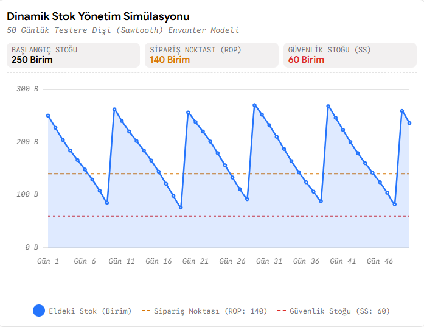

# 📊 Dynamic Safety Stock & Reorder Point (ROP) Simulator

An inventory theory and supply chain project that simulates stochastic daily demand, lead-time variability, and dynamic safety stock buffer policies to optimize working capital while preventing stockouts.

## 📈 Inventory Sawtooth Simulation Output

## 📌 Theoretical Framework
- **Reorder Point (ROP):** $ROP = (\bar{d} \times L) + SS$
- **Safety Stock ($SS$):** $SS = Z \times \sigma_d \times \sqrt{L}$
  - $Z = 1.65$ corresponds to a 95% cycle service level.
  - $\bar{d}$: Average daily demand, $\sigma_d$: Demand standard deviation, $L$: Lead time.

## 🚀 Key Features
- **Stochastic Demand Modeling:** Simulates 50 operating days with normally distributed fluctuations.
- **Automated Replenishment Trigger:** Accurately places lot orders whenever inventory breaches the calculated ROP threshold.
- **Buffer Stock Health Monitoring:** Visualizes real-time protection against supply disruptions.

## 🛠️ Tech Stack
- Python 3.9+
- `numpy`, `matplotlib`
